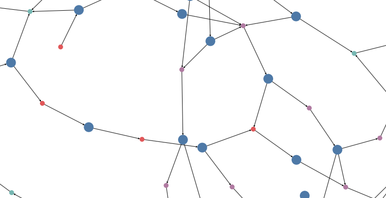

# Prometheus AI
Prometheus AI model, containing the following layers:
* [Neural Network (NN)](src/main/java/nn)
* [Knowledge Node Network (KNN)](src/main/java/knn)
* [Expert System (ES)](src/main/java/es)
* [Meta Reasoner (META)](src/main/java/meta)

The NN and META are basic skeletons at this point.

## Background
### Prometheus Theory
For a basic overview of the theory behind Prometheus, see the reports provided in the [`reports` directory](reports). For further background on the theory of Prometheus, contact [Prof. Vybihal](http://www.cs.mcgill.ca/~jvybihal/).

### Maven
This project is a Java Maven project, with library dependencies specified in the [`pom.xml`](pom.xml) file. Maven allows dependencies to be specified in a file without needing to keep track of jar files. An introduction to Maven can be found [here](https://maven.apache.org/what-is-maven.html).

### Google Guice
Google Guice is used as the backbone for the various dependencies within the code. Guice neatly allows the implementation of various important OOP principles, like dependency inversion. An introduction to Guice can be found [here](https://github.com/google/guice/wiki/Motivation). For more information about the Guice package structure used for Prometheus, see the [Java Package Structure](#package-structure) section.

### Mockito
Mockito is used to create mock objects for behavior-driven unit tests. Mock objects are essentially "fake" versions of objects used to simulate dependencies in unit tests. Mockito couples very well with the dependency injection of Guice. An overview of Mockito can be found [here](http://site.mockito.org/) and an example of behavior-driven development (BDD) with Mockito can be found [here](https://www.tutorialspoint.com/mockito/mockito_bdd.htm).

### TestNG
TestNG is a testing library much like JUnit. It is used for all the unit tests and integration tests found under the [`test`](src/test) directory.

### Apache Commons Lang 3
Apache Commons Lang provides many nice objects to avoid boilerplate code for Java objects. It is used for creating the `hashCode()`, `equals()` and `toString()` methods of most objects in the code. Details on this library can be found [here](https://commons.apache.org/proper/commons-lang/).

### GraphStream
Graphstream is used for plotting the KNN network. Details on this library can be found [here](http://graphstream-project.org/).

## Directory Structure
Here is a list of the each top-level directory and its purpose.

Directory | Contents
--- | ---
[`data`](data) | Input data files for the KNN.
[`docs`](docs) | Javadoc files.
[`graphs`](graphs) | Generated graphs from the various graphing tools.
[`reports`](reports) | Reports on Prometheus.
[`src`](src) | Source code.

## Java Package Structure
Each Java package (with the exception of [`tags`](src/main/java/tags/)) has the following structure for its sub-packages:

Package | Contents | Example
--- | --- | ---
`api` | Public classes and interfaces. Only code relevant for a user of the package should be present here. | [es/api/](src/main/java/es/api/)
`guice` | Public Guice module. This module will be used by a user of the package and should install an internal Guice module. See [`ExpertSystemModule.java`](src/main/java/es/guice/ExpertSystemModule.java) for an example. | [es/guice/](src/main/java/es/guice/)
`internal` | Internal classes and interfaces. Internal code that does not concern a user is found here, as well as an internal Guice module to install internal classes. See [`ExpertSystemInternalModule.java`](src/main/java/es/internal/ExpertSystemInternalModule.java) for an example. | [es/internal/](src/main/java/es/internal/)

## Javadoc
Javadoc can be found [here](http://seanstappas.me/prometheus-ai/).
